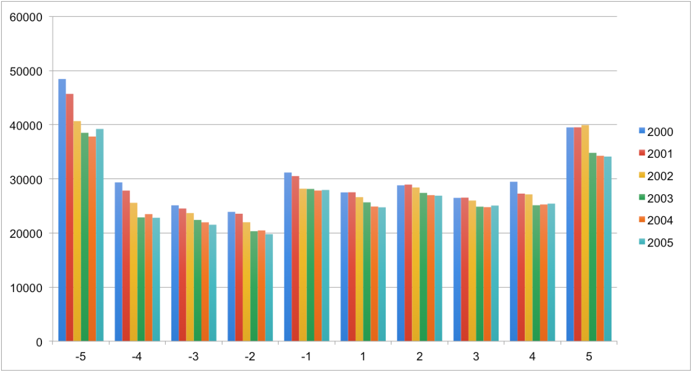
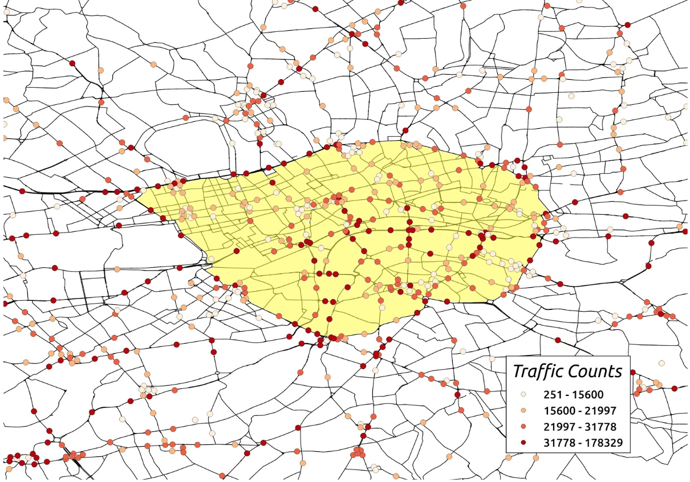
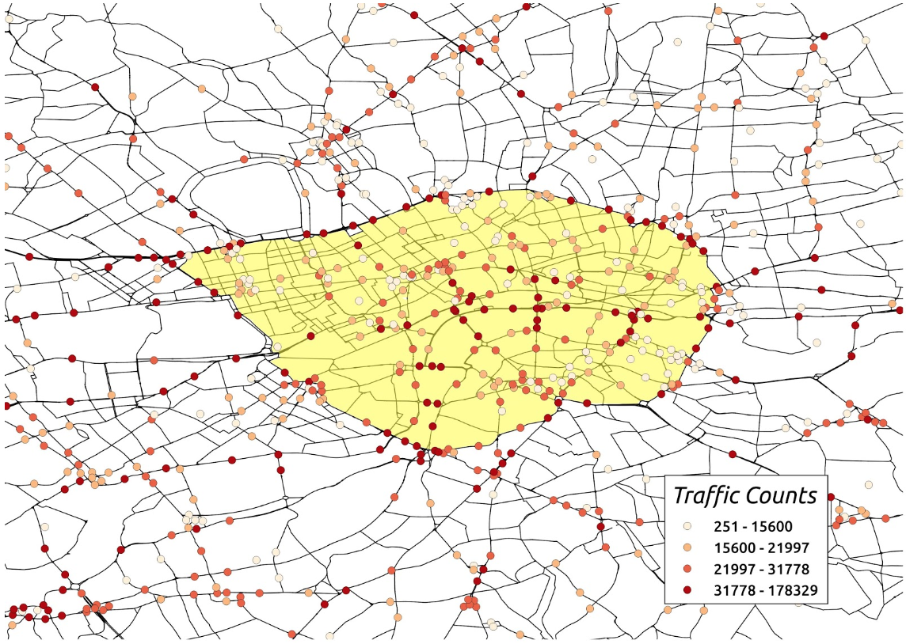

Leila Cabiac 

Samuel Gagnon-Smith 

GLM M2 Fall 2019 

## Open Data - Pr Samuel Goëta
# **London congestion charge (implemented in 2003): evolution of traffic in the Greater London Area from 2000 to 2018**

## Summary:
Drawing from data on traffic in the Greater London Area from 2000 to 2018, this note presents an evolution of traffic in London prior the implementation of the congestion zone, and following its implementation in 2003. We show **evolution of traffic in London over space and time**. We find that, following the implementation of the congestion zone, the areas that show the most significant changes in traffic flows are the core center and the extreme outskirt of the metropolitan area. Intermediary areas have not been too strongly impacted by the congestion zone. If completed by other elements to confirm the causality of these changes in traffic and the implementation of the congestion zone, one policy recommendation would be that **the current shape of the congestion zone is not necessarily the most efficient to target traffic**.

## Dataset description 
The dataset, which is accessible here ( https://roadtraffic.dft.gov.uk/regions/6 , *we were not able to upload the file on the repository because it is larger than 25MB, direct download here -->* https://dft-statistics.s3.amazonaws.com/road-traffic/downloads/aadf/region_id/dft_aadf_region_id_6.csv), we chose was issued by the British Department of Transport, a government authority in charge of planning and investing in transport infrastructure across the United Kingdom. This dataset has been issued every year since 1993 for each local authority in England. For London data currently available is from 2000 to 2018. The Department of Transport sets up count points in the city to register the number of vehicles and their direction (East, West, South, North). Some count points at a specific location have data for all the years and some not (i.e. the location of count points changes over the years). For each count point the precise location (latitude and longitude) is given. Spatial data granularity is of very good quality, over the 18 year period we have information for over 2990 different count points. 

In terms of content, for each count point we have : the raw number of vehicles on an average day for each year, data by type of vehicle (7 type), data by type of road (road length and size) as well as a proxy for “traffic” with a number of vehicles on an average day divided by the length of the road. Because we have only one figure per year for each count point, data granularity over time is not good at all and we can not observe variations for different months or days of the year. To comment the quality of the data briefly : the dataset doesn’t have missing values, the source is reliable and easy to identify. The metadata includes a data disclaimer that precises that “traffic figures at the regional and national level are robust” but that “estimates for individual road links and small areas are not always based on up-to-date counts”. 

***The coding process (Python+GIS) through which we modified the data to produce our graphic representations and analysis is detailed in the annex + ipynb file available in the repository***

## Findings and Recommendation
This analysis reveals two things about the London congestion charge zone. First, while the implementation of the congestion charge zone did in fact coincide with falling rates of traffic within the congestion zone itself, its effects on the area immediately outside the zone is less obvious, and it seems to have caused, at least at some points in time, increases in traffic volumes at the edges of Greater London. Second - a more general observation - the changes that coincide with the implementation of the zone have been geographically and temporally extensive, that is to say they have not affected particular areas (relative to the border of the zone or otherwise). Figures 1 illustrates the change in traffic volumes around the zone before and after the implementation (2002 and 2003). In addition, while the implementation of the zone coincided with significant changes in some areas, these changes are both difficult to impute to the zone itself and nuanced by countervailing changes, or continuity, in other zones (see Figures 3 and 4). 

**Figure 1:** *the x-axis divides the Greater London area into bands based on their distance from the edge of the congestion zone. The negative numbers represent bands 500m thick from the very center of the city (-5) to the edge of the congestion zone (-1). The positive numbers represents bands 5km thick extending from the edge of the zone (1) to the edge of Greater London (5).* 

**Figure 2** *traffic count points by volume in the vicinity of the London congestion charge zone (in yellow), in 2002.*

**Figure 3** *traffic count points by volume in the vicinity of the London congestion charge zone (in yellow), in 2003.*

To provide a more in-depth analysis, the implementation of the congestion charge zone would have to be examined in the light of the general trends in traffic volumes in Greater London in the last three decades - this would hopefully help control for other factors that are affecting increases and reductions in traffic flow, and give a better picture of the congestion zone’s potentially variable effects over time. Nevertheless, we can offer one policy recommendation, though it is perhaps more of a ‘policy warning’: given that the effects of the congestion zone on traffic are difficult to predict and neither local nor punctual, the congestion zone is not an efficient tool for effectuating local changes in traffic volumes (and the same likely holds, therefore, for the eventual effects of traffic, including congestion, accidents and air pollution).   

## Annex 1

**Coding steps to transform the data set**

1 - Create two dictionaries : one records number of vehicles per year and the other their geographic location. 

2 - Divide the points into two geographic groups, one for those inside the zone and one for those without (we cheated on this step and divided them manually in QGIS). 

3 - Calculate the distance between each point and the edge of the zone. 

4 - Divided the points into distance bands (smaller for those inside, larger for those outside). 

5 - Compare total number of vehicles by distance band and year. 

